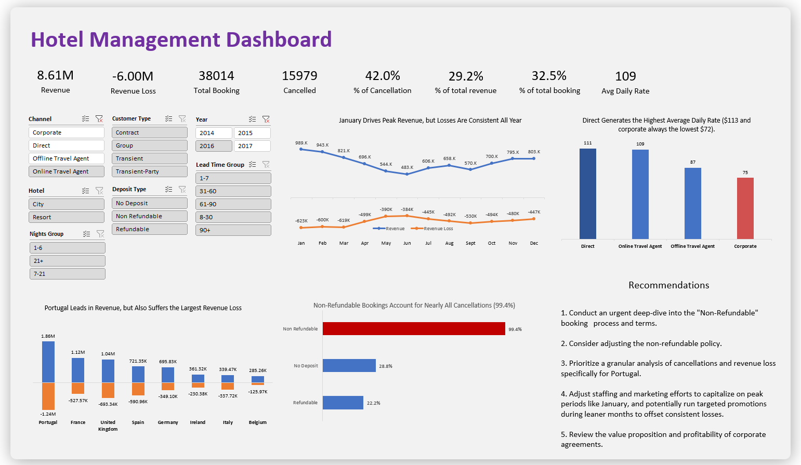

# Hotel Management Excel Dashboard

A comprehensive hotel management system built using Microsoft Excel with advanced data visualization and interactive dashboards for tracking hotel bookings, revenue, and operational analytics.

##  Overview

This project demonstrates a complete hotel management solution using Excel's powerful features including:
- Data analysis and visualization
- Interactive dashboards with slicers
- Booking data management
- Revenue tracking and insights
- Dynamic charts and pivot tables

##  Dashboard Screenshots

### Interactive Dashboard with Slicers

The dashboard features interactive slicers that allow users to:
- Filter data by specific date ranges
- View metrics by different categories
- Customize dashboard views in real-time
- Drill down into specific data segments

##  Features

### Dashboard Components
- **Booking Analytics**: Track hotel bookings over time with detailed metrics
- **Revenue Analysis**: Monitor revenue streams and financial performance
- **Interactive Slicers**: Filter data by various parameters for customized views
- **Visual Charts**: Multiple chart types for better data representation
- **Data Tables**: Organized booking data with comprehensive details

### Key Metrics Tracked
- Total bookings and reservations
- Revenue by time periods
- Occupancy rates
- Customer demographics
- Booking sources and channels
- Room type performance

##  Customization

The dashboard can be customized to include:
- Additional metrics and KPIs
- Custom date ranges
- New chart types
- Enhanced filtering options
- Integration with external data sources

##  Data Analysis Features

- **Pivot Tables**: Dynamic data summarization
- **Charts & Graphs**: Visual representation of trends
- **Conditional Formatting**: Highlight important data points
- **Data Validation**: Ensure data integrity
- **Formulas & Functions**: Advanced calculations and metrics

## Author
- **Shawon Mandal**  
  [LinkedIn Profile](https://www.linkedin.com/in/shawon-mandal-160440260/)

---

> _For detailed analysis, refer to the interactive dashboard and source Excel file._

